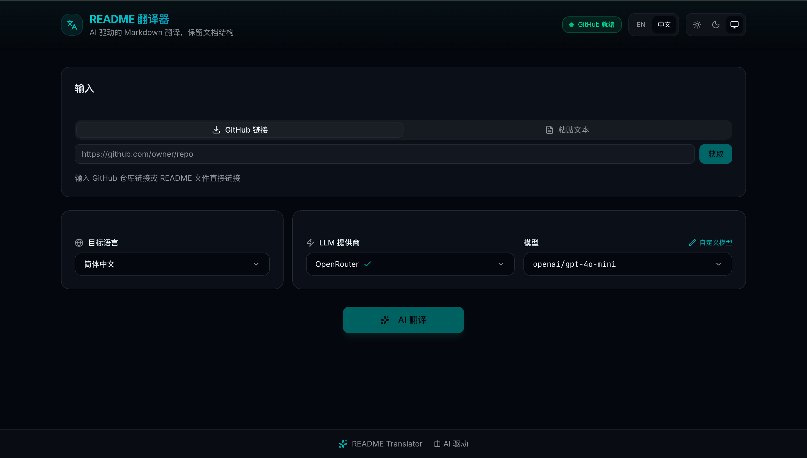
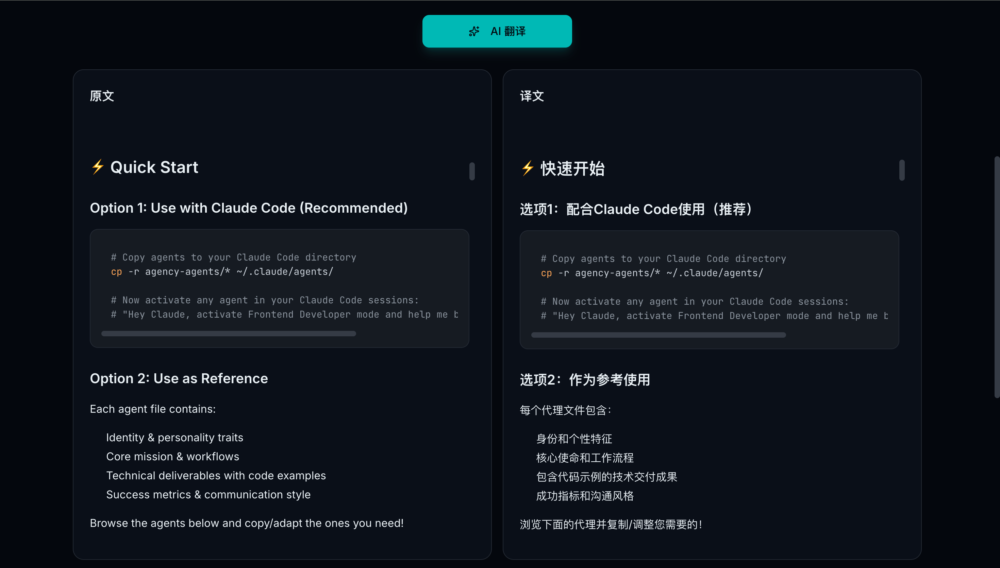
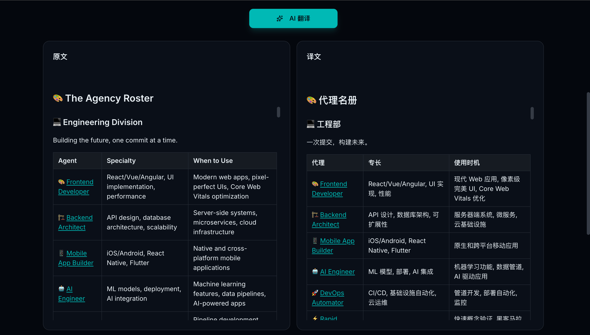

# README Translator

> AI-powered Markdown translation tool that preserves document structure and formatting

[中文文档](../README.md)

## Introduction

README Translator is a document translation tool powered by Large Language Models. It can translate GitHub README files into multiple languages while **perfectly preserving** the original Markdown format, code blocks, links, and reference structures.

---

## Interface Preview



---

## Use Cases






---

## Features

| Feature | Description |
|---------|-------------|
| Multi-Model Support | OpenAI, Anthropic Claude, Zhipu AI, OpenRouter, Ollama (local) |
| Structure Preservation | Headings, code blocks, tables, links, images remain intact |
| Citation Protection | Academic citations like `[1]`, `[Smith et al., 2020]` stay unchanged |
| GitHub Integration | Fetch README directly from GitHub URLs |
| Real-time Preview | Side-by-side comparison with live translation progress |
| Theme Support | Light/dark themes with system preference detection |
| Multi-language UI | Interface available in English and Chinese |

## Supported Translation Languages

Simplified Chinese, Traditional Chinese, Japanese, Korean, Spanish, French, German, Portuguese, Russian, Arabic

---

## Quick Start

### 1. Install Dependencies

```bash
git clone https://github.com/Orion416/Readme-Translator.git
cd Readme-Translator
npm install
```

### 2. Configure Environment Variables

Copy the template and add your API keys:

```bash
cp .env.example .env
```

Edit `.env` file:

```env
# Configure at least one AI provider
OPENAI_API_KEY=sk-...
ANTHROPIC_API_KEY=sk-ant-...
ZHIPU_API_KEY=...
OPENROUTER_API_KEY=sk-or-...
OLLAMA_BASE_URL=http://127.0.0.1:11434

# Optional: Increase GitHub API rate limit
GITHUB_TOKEN=ghp_...

```

### 3. Start the Server

```bash
npm run dev
```

Open http://localhost:3000 in your browser.

---

## Usage Guide

### Method 1: Translate from GitHub URL

1. Select **GitHub URL** tab
2. Enter a GitHub repository URL, for example:
   - Repository homepage: `https://github.com/vercel/next.js`
   - Specific file: `https://github.com/vercel/next.js/blob/canary/readme.md`
3. Click **Fetch** to retrieve the README
4. Select **Target Language** and **AI Provider**
5. Click **AI Translate** to start

### Method 2: Paste Text

1. Select **Paste Text** tab
2. Paste your Markdown content into the text area
3. Select **Target Language** and **AI Provider**
4. Click **AI Translate** to start

### Export Translation

- **Download**: Save the translation as a `.md` file
- **Copy**: Copy to clipboard with one click

---

## Project Structure

```
src/
├── app/                    # Next.js pages and API
│   ├── api/
│   │   ├── fetch-readme/   # GitHub README fetcher
│   │   ├── providers/      # Provider status check
│   │   ├── translate/      # Translation API (streaming)
│   │   └── validate/       # Structure validation
│   ├── layout.tsx
│   └── page.tsx
├── components/
│   ├── ui/                 # Base UI components
│   ├── layout/             # Layout components
│   └── features/           # Feature components
├── lib/
│   ├── github/             # GitHub API wrapper
│   ├── i18n/               # Internationalization
│   ├── markdown/           # Markdown processing
│   ├── translation/        # Translation engine
│   └── validation/         # Structure validation
└── types/                  # TypeScript definitions
```

---

## Translation Protection

The following elements are protected during translation:

| Element | Example | Protection Method |
|---------|---------|-------------------|
| Code blocks | ` ```python ... ``` ` | Replace with placeholder |
| Inline code | `` `code` `` | Replace with placeholder |
| Links | `[text](url)` | Replace with placeholder |
| Images | `` | Replace with placeholder |
| Numeric citations | `[1]`, `[2,3,4]` | Keep unchanged |
| Academic citations | `[Smith et al., 2020]` | Keep unchanged |

---

## Commands

```bash
npm run dev      # Start development server
npm run build    # Build for production
npm run start    # Start production server
npm run lint     # Run ESLint
```

---

## License

MIT License
